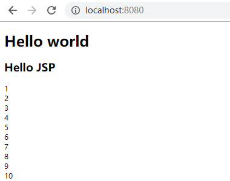

---

title: Hello World!——内嵌Jetty支持Servlet
date: 2018-12-10 23:38:56
tags: [Hello World,Jetty,内嵌Jetty,Servlet,jsp]
categories: Hello World系列

---

Hello World!——内嵌Jetty支持Servlet
----------------------------------


## 一、引入依赖包

内嵌Jetty支持servlet、jsp, jsp支持jstl和el表达式，除了需要引入jetty-webapp之外，还需要引入apache-jsp和apache-jstl， jsp也是编译成servlet。 


```xml

<dependency>
	<groupId>org.eclipse.jetty</groupId>
	<version>9.4.14.v20181114</version>
	<artifactId>jetty-webapp</artifactId>
</dependency>
<dependency>
	<groupId>org.eclipse.jetty</groupId>
	<version>9.4.14.v20181114</version>
	<artifactId>apache-jsp</artifactId>
</dependency>
<dependency>
	<groupId>org.eclipse.jetty</groupId>
	<version>9.4.14.v20181114</version>
	<artifactId>apache-jstl</artifactId>
</dependency>

```

## 二、配置支持servlet, jsp, jstl, el表达式

#### 1、支持servlet 

内嵌jetty支持servlet，只需要引入WebAppContext作为handler就可以支持

```java

// 用WebAppContext可以支持servlet
WebAppContext webApp = new WebAppContext();
webApp.setContextPath("/");
webApp.setResourceBase("./src/main/webapp");

```

#### 2、支持jsp 

但是, 要支持jsp还需要配置两个Configuration

```java
// 支持JSP必须增加以下配置
Configuration.ClassList classlist = Configuration.ClassList.setServerDefault(server);
classlist.addBefore("org.eclipse.jetty.webapp.JettyWebXmlConfiguration",
				"org.eclipse.jetty.annotations.AnnotationConfiguration");

```

```html 
<!DOCTYPE html>
<html>
<head>
    <meta http-equiv="Content-Type" content="text/html; charset=$Encode">
    <title>show page</title>
</head>
<body>
	<h1>Hello world</h1>
    <% out.println("<h2>Hello JSP</h2>"); %>
</body>
</html>
```

可以正常输出Hello World和Hello JSP。 

#### 3、支持jstl和el表达式

如果在jsp中需要用到jstl和el表达式， 还需要配置容器引入的包格式：


```java
//支持jstl和其他tag必须设置以下配置
webApp.setAttribute(
    "org.eclipse.jetty.server.webapp.ContainerIncludeJarPattern",
        ".*/[^/]*servlet-api-[^/]*\\.jar$|.*/javax.servlet.jsp.jstl-.*\\.jar$|.*/[^/]*taglibs.*\\.jar$" );

```

jsp文件头中还需要特殊处理下， 增加配指令，否则会忽略el表达式： 

```jsp
<%@ page language="java" contentType="text/html; charset=utf-8" pageEncoding="utf-8" isELIgnored="false" %>

```


```jsp
<%@ taglib prefix="c" uri="http://java.sun.com/jsp/jstl/core" %> 
  <c:forEach var="i" begin="1" end="10" step="1">
  <c:out value="${i}" />
  <br />
</c:forEach>
```

> <%@ ... %> 是指令 <br/>
> <% ... %> 是jsp脚本 <br/>
> <c:... /> 是jstl标签 <br/>
> ${...} 是el表达式 


## 三、增加servlet、web.xml和index.jsp 

具体示例代码如下： 

#### 1、内嵌Jetty的启动类

```java
import org.eclipse.jetty.server.Server;
import org.eclipse.jetty.webapp.Configuration;
import org.eclipse.jetty.webapp.WebAppContext;
import lombok.extern.slf4j.Slf4j;

@Slf4j
public class JettyWebAppApplication {
	public static void main(String[] args) {
		Server server = new Server(8080);

		// 支持JSP必须增加以下配置
		Configuration.ClassList classlist = Configuration.ClassList.setServerDefault(server);
		classlist.addBefore("org.eclipse.jetty.webapp.JettyWebXmlConfiguration",
				"org.eclipse.jetty.annotations.AnnotationConfiguration");
		
		// 用WebAppContext可以支持servlet
		WebAppContext webApp = new WebAppContext();
		webApp.setContextPath("/");
		webApp.setResourceBase("./src/main/webapp");
		// 支持jstl和其他tag必须设置以下配置
		webApp.setAttribute("org.eclipse.jetty.server.webapp.ContainerIncludeJarPattern",
			".*/[^/]*servlet-api-[^/]*\\.jar$|.*/javax.servlet.jsp.jstl-.*\\.jar$|.*/[^/]*taglibs.*\\.jar$");

		server.setHandler(webApp);

		try {
			server.start();
			server.dumpStdErr();
			server.join();
		} catch (Exception e) {
			log.error(e.getMessage(), e);
		}
	}
}
```

#### 2、Servlet的demo类

```java
import java.io.IOException;
import javax.servlet.GenericServlet;
import javax.servlet.ServletException;
import javax.servlet.ServletRequest;
import javax.servlet.ServletResponse;
import com.alibaba.fastjson.JSON;
import lombok.extern.slf4j.Slf4j;

@Slf4j
public class HelloWorldServletDemo extends GenericServlet {
	private static final long serialVersionUID = -1522387682150936960L;

	@Override
	public void init() throws ServletException {
		super.init();
	}

	@Override
	public void service(ServletRequest req, ServletResponse res) throws ServletException, IOException {
		log.info("remote: {} params: {} ", req.getRemoteAddr(), JSON.toJSONString(req.getParameterMap()));
		res.getWriter().write("<h1>Hello World Servlet</h1>");
	}
}
```

#### 3、web.xml配置

```xml
<!DOCTYPE web-app PUBLIC
 "-//Sun Microsystems, Inc.//DTD Web Application 2.5//EN"
 "http://java.sun.com/dtd/web-app_2_5.dtd" >

<web-app>
  <display-name>Archetype Created Web Application</display-name>
  <servlet>
        <servlet-name>hello</servlet-name>
        <servlet-class>org.demo.hello.world.jetty.servlet.HelloWorldServletDemo</servlet-class>
        <init-param>
            <param-name>debug</param-name>
            <param-value>0</param-value>
        </init-param>
        <init-param>
            <param-name>listings</param-name>
            <param-value>false</param-value>
        </init-param>
        <load-on-startup>1</load-on-startup>
    </servlet>

 	<!-- The mapping for the default servlet -->
    <servlet-mapping>
        <servlet-name>hello</servlet-name>
        <url-pattern>/hello</url-pattern>
    </servlet-mapping>
</web-app>
```

#### 4、jsp页面

```jsp
<!-- 在jar包都有的前提下EL表达式原样输出，不被解析  原因是  page指令中确少 isELIgnored="false" servlet3.0默认关闭了el表达式的解析 -->
<%@ page language="java" contentType="text/html; charset=utf-8" pageEncoding="utf-8" isELIgnored="false" %>

<!DOCTYPE html>
<html>
<head>
    <meta http-equiv="Content-Type" content="text/html; charset=$Encode">
    <title>show page</title>
</head>
<body>
	<h1>Hello world</h1>
    <% out.println("<h2>Hello JSP</h2>"); %>
    
    <%@ taglib prefix="c" uri="http://java.sun.com/jsp/jstl/core" %> 
	  <c:forEach var="i" begin="1" end="10" step="1">
      <c:out value="${i}" />
      <br />
    </c:forEach>
</body>
</html>
```

## 四、运行效果

运行效果如图

